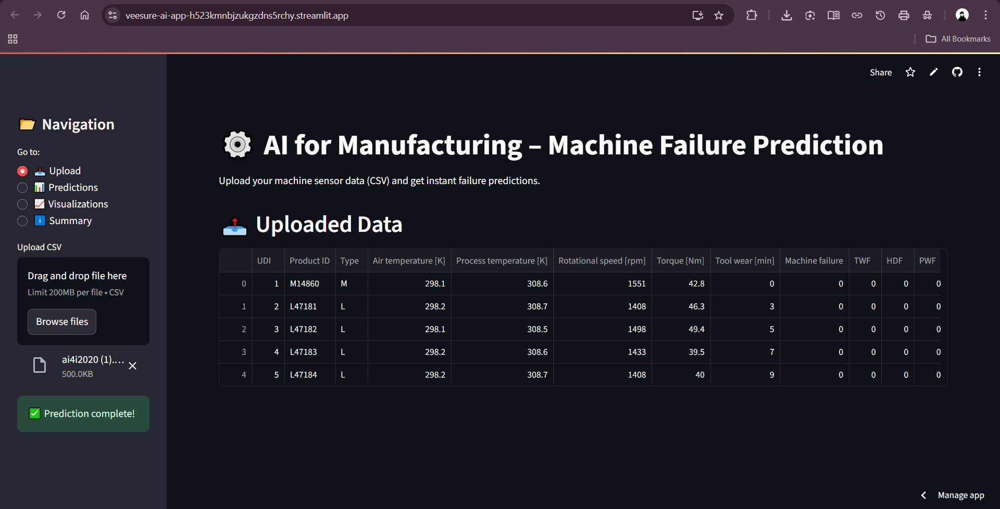
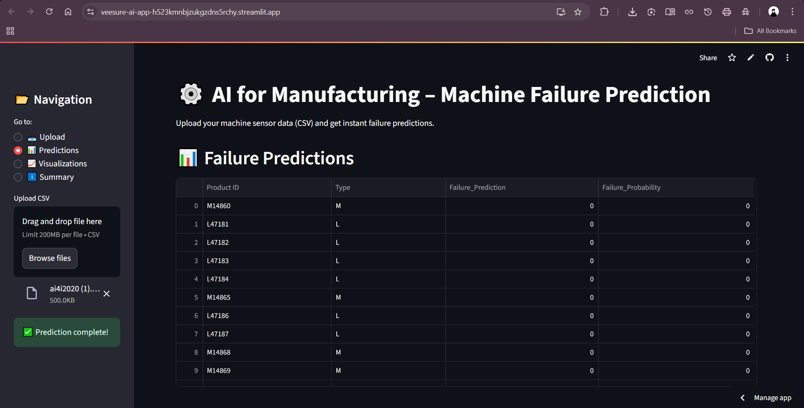
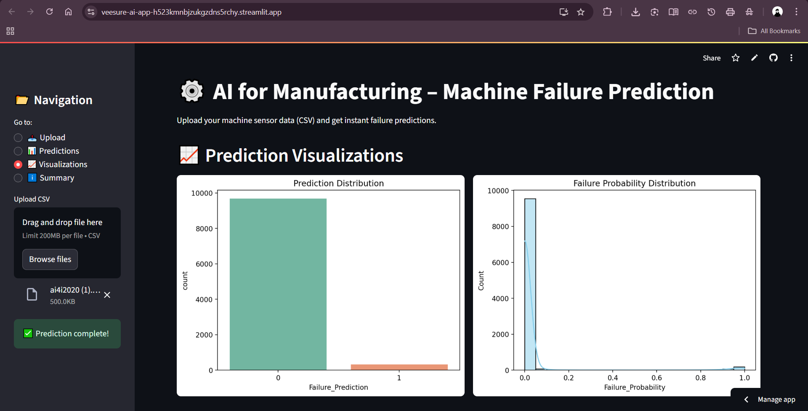
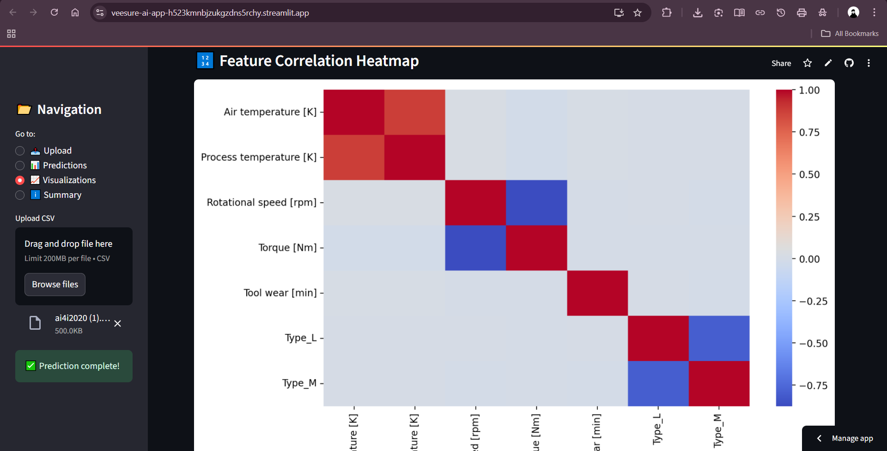
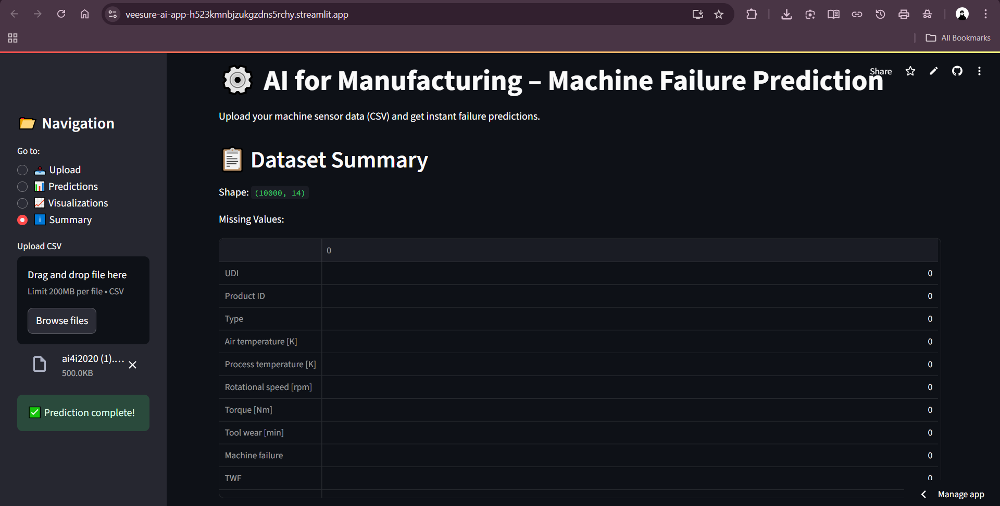

<h1 align="center">⚙️ Veesure AI – Machine Failure Predictor</h1>

<p align="center">
  <a href="https://veesure-ai-app-h523kmnbjzukgzdns5rchy.streamlit.app">
    
  </a>
</p>

---

### 📌 About the Project

Veesure AI is a machine failure prediction system built for **Veesure Animal Health** under the **Intel AI for Manufacturing** initiative.  
It uses real-time sensor data to predict failures and provides insightful visualizations for industrial operations.

---

### 📸 App Screenshots

| 🖼️ Upload Interface | 📊 Prediction Output |
|---------------------|----------------------|
|  |  |

| 📈 Prediction Visualization | 🔥 Correlation Heatmap |
|-----------------------------|-------------------------|
|  |  |

| 📋 Dataset Summary | 📌 Descriptive Analysis |
|--------------------|-------------------------|
|  |  |

---

### 🚀 Live Demo

Click here to try the app:  
👉 [Click here to try the app](https://veesure-ai-app-h523kmnbjzukgzdns5rchy.streamlit.app)

---

### 📊 Features

- 📥 Upload sensor data (CSV)
- 🔍 Predict machine failure using a trained AI model
- 📈 Visualizations:
  - Prediction distribution (Seaborn)
  - Failure probability histogram (Plotly)
  - Torque analysis by machine type
  - 🔥 Correlation heatmap
- 🧠 Powered by XGBoost and Scikit-learn

---

### 🔧 Tech Stack

| Category     | Tools |
|--------------|-------|
| Language     | Python 3.10 |
| ML Models    | XGBoost, scikit-learn |
| Dashboard    | Streamlit |
| Visualization | Matplotlib, Seaborn, Plotly |
| Hosting      | Streamlit Cloud |
| Dev Tools    | VS Code, Git, GitHub |


---

### 📥 How to Run Locally

```bash
git clone https://github.com/Manwikkk/veesure-ai-app.git
cd veesure-ai-app
pip install -r requirements.txt
streamlit run app.py

```
# 📦 Requirements
- Install with:
  
```bash
pip install -r requirements.txt
```


### Main Libraries:

- streamlit

- pandas

- numpy

- scikit-learn

- xgboost

- matplotlib

- seaborn

- plotly

---


# 📈 Future Improvements
- ✅ Support real-time sensor streaming
- ✅ Live dashboard with refresh intervals
- ✅ Root cause failure analysis
- ✅ Export PDF maintenance reports
- ✅ Integrate with IoT devices and APIs

---

# 🔚 Conclusion
This prediction app gives manufacturers a reliable, AI-driven solution to assess machine health using sensor data.
With feature engineering, model prediction, and rich visual feedback, it enables smarter maintenance planning and data-driven decision-making for industry-ready operations. ⚙️📊

---
